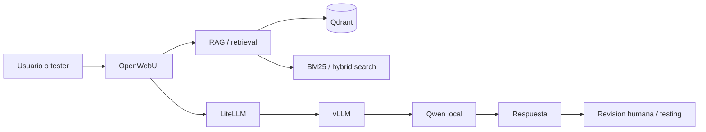

# Guia de estudio autoexplicativa

Esta nota es la puerta de entrada cuando sientas que una nota concreta es demasiado breve. La idea de esta bóveda no es memorizar nombres de herramientas, sino construir una cadena mental completa:

```text
requisito -> busqueda -> contexto -> LLM -> respuesta -> validacion -> trazabilidad
```

En Technica, por lo que has contado, el proyecto mezcla infraestructura, retrieval, LLMs locales, repositorios grandes y datos de automoción. Eso puede parecer mucho, pero casi todo encaja en una arquitectura única.

## Modelo mental principal



Cada pieza responde a una pregunta:

| Pieza | Pregunta que responde | Si falla, que se nota |
|---|---|---|
| [[Docker]] | Como arranco servicios repetibles | Nada levanta, puertos ocupados, volumenes mal |
| [[Git_Basico]] / [[Diff_y_Patch]] | Que ha cambiado respecto a una base | Patch no aplica, repo incomprensible |
| [[Como_leer_un_repo_grande_sin_IA]] | Donde esta la logica real | Lees archivos al azar |
| [[Testing_basado_en_requisitos]] | Que significa cubrir un requisito | El sistema no es evaluable |
| [[Embeddings_para_requisitos]] | Como encuentro requisitos parecidos | Resultados irrelevantes |
| [[BM25]] / [[Hybrid_Search]] | Como mezclo semantica y terminos exactos | Pierdes IDs, siglas o parafrasis |
| [[Qdrant]] | Donde guardo vectores y metadata | No puedes filtrar ni recuperar bien |
| [[OpenWebUI]] | Donde interactua el usuario | La UI no refleja el backend real |
| [[LiteLLM]] / [[vLLM]] / [[Qwen_Local]] | Como se sirve el modelo | Latencia, OOM, streaming roto |
| [[Qodo]] / [[Code_Embeddings]] | Como busco codigo semanticamente | Grep no basta |
| [[LangGraph]] / [[MCP]] | Como convierto pasos en workflow | Agentes opacos y poco controlables |
| [[Wireshark]] / [[CAN]] / [[UDS]] | Que datos de automocion miro | No entiendes las trazas |
| [[Autoencoders]] | Como detecto anomalias | Thresholds arbitrarios |
| [[Atencion_entre_dos_requisitos]] | Como inspecciono relaciones token a token | Confundes similitud con explicacion |

## Como estudiar sin quedarte en teoria

Para cada tema sigue siempre la misma secuencia:

1. **Problema**: que dolor resuelve.
2. **Modelo mental**: como funciona por dentro a alto nivel.
3. **Comandos o codigo**: como lo observo en mi maquina.
4. **Fallo tipico**: que error aparece si lo entiendo mal.
5. **Mini entrega**: una nota, script, tabla o diagrama que demuestra que lo he entendido.

> [!warning]
> Si solo lees documentacion externa, no estas entrenando la habilidad que necesitas en la empresa. Debes convertir cada recurso en una accion local: comando, script, mapa de repo, tabla de requisitos o conclusion escrita.

## Ruta de lectura profunda

Empieza por estas notas nuevas si quieres una explicacion de curso:

- [[Curso_Docker_desde_cero_para_Technica]]
- [[Curso_Git_Patch_Repos_grandes]]
- [[Curso_Testing_Requisitos_Automocion]]
- [[Curso_Embeddings_RAG_Qdrant_desde_cero]]
- [[Curso_OpenWebUI_empresa_patch]]
- [[Curso_Inferencia_vLLM_LiteLLM_Qwen_desde_cero]]
- [[Curso_Code_Embeddings_Qodo_desde_cero]]
- [[Curso_LangGraph_MCP_desde_cero]]
- [[Curso_Wireshark_CAN_UDS_DoIP_desde_cero]]
- [[Curso_Autoencoders_CAN_desde_cero]]
- [[Curso_Atencion_entre_requisitos_desde_cero]]

## Como saber si una nota esta aprendida

Una nota esta aprendida cuando puedes hacer esto sin mirarla:

- [ ] Explicar el concepto en voz alta en menos de 2 minutos.
- [ ] Dar un ejemplo relacionado con OpenWebUI, requisitos o automocion.
- [ ] Ejecutar un comando o script relacionado.
- [ ] Decir un error comun y como diagnosticarlo.
- [ ] Escribir una pregunta concreta para tu jefe o equipo.

## Preguntas que debes hacerte cada dia

- Que pieza de la arquitectura entiendo mejor que ayer?
- Que comando he ejecutado hoy?
- Que archivo de un repo real he leido?
- Que output he interpretado?
- Que duda sigue abierta?

## Producto final esperado de la bóveda

Al acabar el roadmap deberias poder:

- levantar servicios con Docker y leer logs con criterio;
- entender por que una empresa aplica un patch sobre una imagen oficial;
- leer un repo grande de backend/frontend sin depender de IA;
- modelar requirements, test cases, coverage, gaps y duplicados;
- construir un retrieval basico con embeddings, BM25, hybrid search y Qdrant;
- entender donde encajan OpenWebUI, LiteLLM, vLLM y Qwen;
- inspeccionar code embeddings y compararlos con `rg`;
- diseñar workflows con LangGraph/MCP sin convertirlos en magia;
- leer trazas CAN/UDS/DoIP a nivel operativo;
- entrenar un autoencoder sencillo para anomalias CAN;
- implementar atencion entre dos requisitos y visualizarla sin sobreinterpretarla.

