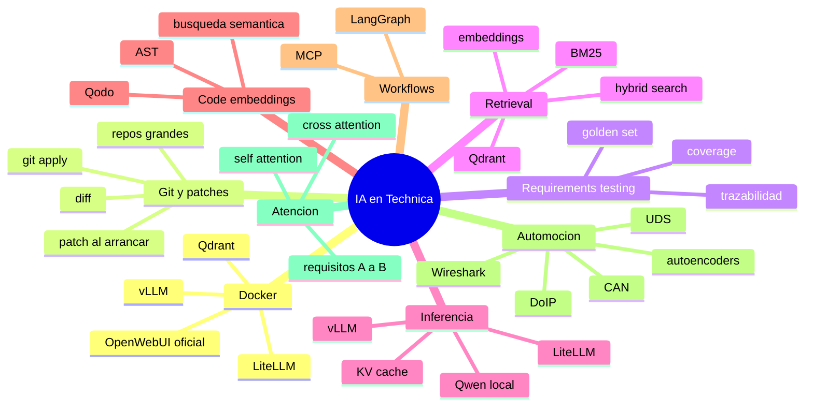

# Mapa general

## Lectura priorizada

1. [[Docker]]
2. [[Diff_y_Patch]]
3. [[Como_leer_un_repo_grande_sin_IA]]
4. [[Testing_basado_en_requisitos]]
5. [[Embeddings_para_requisitos]]
6. [[BM25]]
7. [[Hybrid_Search]]
8. [[Qdrant]]
9. [[OpenWebUI]]
10. [[Motor_de_inferencia]]
11. [[Qodo]]
12. [[LangGraph]]
13. [[Wireshark]]
14. [[Autoencoders]]
15. [[Atencion_entre_dos_requisitos]]

## Lección guiada

Usa esta nota como punto de navegación. Antes de avanzar, identifica qué módulo estás estudiando, qué práctica vas a ejecutar y qué evidencia dejarás en el diario.

- [ ] He elegido una ruta concreta para hoy.
- [ ] Sé qué archivo abrir después.
- [ ] Sé qué comando, script o checklist usaré.
- [ ] He escrito una salida esperada antes de ejecutar nada.
