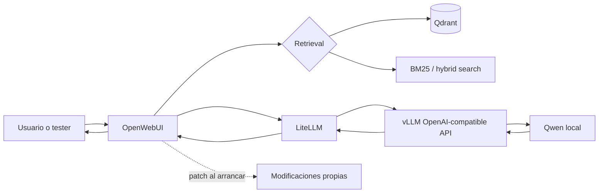

# Roadmap Maestro

## Objetivo global

Ser útil en un proyecto de automatización de testing basado en requisitos/especificaciones. Eso significa entender cómo se despliegan los servicios, cómo se modifica una imagen oficial con un patch, cómo se leen repos grandes, cómo se representan requisitos, cómo se recuperan documentos similares, cómo se sirve un LLM local y cómo se conectan piezas de automoción como Wireshark/CAN con modelos de anomalías.

## Arquitectura mental del sistema

Usuario -> [[OpenWebUI]] -> retrieval/[[Qdrant]] -> [[LiteLLM]] -> [[vLLM]] -> [[Qwen_Local]] -> respuesta

## Prioridad de estudio

1. [[Docker]]: si no puedes levantar, inspeccionar y leer logs de servicios, todo lo demás queda abstracto.
2. [[Diff_y_Patch]] y [[Git_Apply]]: la empresa usa imagen oficial + modificaciones propias.
3. [[Como_leer_un_repo_grande_sin_IA]]: necesitas orientarte sin depender de un chatbot.
4. [[Testing_basado_en_requisitos]]: el dominio funcional del proyecto.
5. [[Embeddings_para_requisitos]], [[BM25]], [[Hybrid_Search]], [[Qdrant]]: núcleo del retrieval.
6. [[OpenWebUI]]: interfaz y punto de integración.
7. [[Motor_de_inferencia]], [[LiteLLM]], [[vLLM]], [[Qwen_Local]]: serving de LLMs.
8. [[Qodo]] y [[Code_Embeddings]]: búsqueda semántica sobre código.
9. [[LangGraph]] y [[MCP]]: workflows y herramientas.
10. [[Wireshark]], [[CAN]], [[UDS]], [[DoIP]], [[Autoencoders_para_paquetes_CAN]]: datos de automoción y anomalías.

## Qué estudiar primero y por qué

Empieza por Docker porque OpenWebUI, Qdrant, LiteLLM y vLLM suelen aparecer como servicios. Después aprende Git/patch porque "aplicar un diff al arrancar un contenedor" combina repos, archivos y comandos de sistema. Luego estudia requisitos/testing porque te da el vocabulario para entender qué quiere automatizar el sistema.

## Qué NO estudiar aún

- No empieces optimizando GPUs antes de entender `docker logs`.
- No estudies LangGraph antes de poder describir un workflow manual.
- No intentes explicar atención como causalidad; primero implementa [[Atencion_desde_cero]].
- No indexas un repo completo antes de saber hacer `rg`, leer imports y construir un mapa.

## Relación entre las piezas

[[OpenWebUI]] es la interfaz. [[Qdrant]] guarda vectores y payloads para recuperar requisitos/documentos. [[BM25]] recupera por coincidencia léxica. [[Hybrid_Search]] combina ambos. [[LiteLLM]] normaliza llamadas a modelos. [[vLLM]] sirve modelos locales de forma eficiente. [[Qwen_Local]] es el modelo. [[Git_Apply]] explica cómo meter cambios propios encima de una imagen oficial. [[Qodo]] y [[Code_Embeddings]] ayudan a buscar código por intención. [[Wireshark]] y [[CAN]] aportan datos de automoción que pueden analizarse con [[Autoencoders]].

## Checklist por módulos

- [ ] Docker: levanto nginx, Qdrant y leo logs.
- [ ] Git/patch: genero y aplico un `.patch`.
- [ ] Repo grande: creo un `MAPA_REPO.md` útil.
- [ ] Requirements testing: distingo gap, duplicado, contradicción y cobertura.
- [ ] Retrieval: calculo top-k, threshold, precision@k y recall@k.
- [ ] Qdrant: creo colección, points y filtros por metadata.
- [ ] OpenWebUI: sé inspeccionar contenedor y buscar `hybrid_search`, `bm25`, `qdrant`.
- [ ] Inferencia: explico KV cache, batching, streaming y API OpenAI-compatible.
- [ ] Qodo/code embeddings: comparo `rg` contra búsqueda semántica.
- [ ] LangGraph/MCP: dibujo un workflow de testing.
- [ ] Wireshark/CAN: leo timestamp, ID, DLC y payload.
- [ ] Autoencoders: entreno con normal y detecto anomalías por reconstruction error.
- [ ] Atención: visualizo atención A->B y B->A entre requisitos.

## Ruta profunda autoexplicativa

Cuando una pieza no este clara, no saltes directamente a documentacion externa. Primero lee la leccion profunda correspondiente y despues ejecuta el lab asociado.

- Docker: [[Curso_Docker_desde_cero_para_Technica]]
- Git/patch/repos: [[Curso_Git_Patch_Repos_grandes]]
- Testing/requisitos: [[Curso_Testing_Requisitos_Automocion]]
- Retrieval/Qdrant: [[Curso_Embeddings_RAG_Qdrant_desde_cero]]
- OpenWebUI: [[Curso_OpenWebUI_empresa_patch]]
- Inferencia: [[Curso_Inferencia_vLLM_LiteLLM_Qwen_desde_cero]]
- Code embeddings/Qodo: [[Curso_Code_Embeddings_Qodo_desde_cero]]
- LangGraph/MCP: [[Curso_LangGraph_MCP_desde_cero]]
- Wireshark/CAN/UDS/DoIP: [[Curso_Wireshark_CAN_UDS_DoIP_desde_cero]]
- Autoencoders: [[Curso_Autoencoders_CAN_desde_cero]]
- Atencion: [[Curso_Atencion_entre_requisitos_desde_cero]]

## Ampliación curso: mapa causal del proyecto

Piensa el proyecto como una cadena de decisiones y fallos posibles:

1. **Despliegue**: Docker arranca servicios. Si falla aquí, no hay IA que depurar.
2. **Customización**: un patch modifica OpenWebUI o backend. Si falla aquí, la app puede arrancar sin la funcionalidad esperada.
3. **Datos**: requisitos, tests, documentos, repos y trazas CAN. Si los datos están mal modelados, el retrieval será engañoso.
4. **Retrieval**: BM25, embeddings, hybrid search y Qdrant recuperan candidatos. Si recuperas mal, el LLM razona sobre contexto equivocado.
5. **Inferencia**: LiteLLM/vLLM/Qwen generan respuesta. Si hay latencia, memoria o endpoint mal configurado, falla la experiencia.
6. **Evaluación**: golden sets, coverage, precision/recall y revisión humana separan demo de sistema útil.

### Pregunta guía por componente

| Componente | Pregunta que debes poder contestar | Evidencia práctica |
|---|---|---|
| Docker | ¿Qué proceso está corriendo y con qué configuración? | `docker compose ps`, `logs`, `exec` |
| Patch | ¿Qué archivos cambia y cómo sé que se aplicó? | `git apply --check`, grep dentro del contenedor |
| Repo | ¿Dónde entra la petición y dónde se llama a Qdrant/modelo? | `MAPA_REPO.md` con rutas |
| Requirements | ¿Qué requisito cubre cada test? | `coverage_checker.py` |
| Embeddings | ¿Qué candidatos recupera y con qué errores? | top-k + thresholds |
| BM25 | ¿Qué siglas/IDs exactos dominan el ranking? | ranking lexical |
| Qdrant | ¿Qué payload permite filtrar y auditar? | collection + points |
| OpenWebUI | ¿Qué configuración conecta UI, RAG y modelo? | docker-compose + logs |
| vLLM/LiteLLM | ¿Quién sirve el modelo y quién enruta? | curl `/v1/chat/completions` |
| Qodo/code embeddings | ¿Qué búsqueda exacta no basta? | comparación con `rg` |
| Wireshark/CAN | ¿Qué campos se convierten en features? | tabla de frames |
| Autoencoder | ¿Qué error activa anomalía? | threshold + métricas |

### Qué significa "ser útil" en una reunión técnica

No necesitas decir "sé de RAG". Necesitas poder decir:

- "El problema parece estar antes del LLM: Qdrant no devuelve candidatos para este módulo".
- "Este patch depende de una función que cambió de nombre en la versión nueva".
- "BM25 recupera mejor este caso porque `0x22` y `NRC 0x31` son tokens exactos".
- "El threshold actual prioriza recall, pero está generando falsa cobertura".
- "La latencia que vemos parece prefill/contexto largo, no decodificación lenta".

## Lección guiada

Esta nota pertenece al plan de estudio. No la leas como una lista pasiva: conviértela en agenda.

### Preguntas

- ¿Qué bloque reduce más incertidumbre esta semana?
- ¿Qué entregable demostraría que lo entiendo?
- ¿Qué tema debo posponer aunque sea interesante?

### Evidencia de dominio

- [ ] Puedo explicar por qué este paso va antes que el siguiente.
- [ ] Tengo un entregable pequeño asociado.
- [ ] He marcado una duda para preguntar en la empresa.
