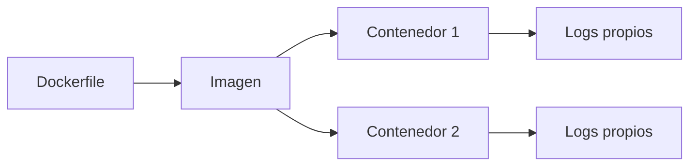

# Curso Docker desde cero para Technica

## 1. El problema real

Antes de Docker, instalar una aplicacion compleja significaba instalar dependencias en tu maquina: Python, Node, CUDA, librerias del sistema, bases de datos, variables de entorno y configuraciones. Eso funciona hasta que otra persona intenta repetirlo y falla por una version distinta.

Docker intenta resolver este problema: **empaquetar una aplicacion con su entorno de ejecucion** para que se pueda arrancar de forma repetible.

En tu contexto:

- [[OpenWebUI]] es una aplicacion web con backend y frontend.
- [[Qdrant]] es una base vectorial.
- [[LiteLLM]] puede actuar como gateway.
- [[vLLM]] sirve modelos locales como [[Qwen_Local]].

Instalar todo directamente en Windows seria fragil. Con Docker, cada pieza vive en un contenedor.

## 2. Imagen, contenedor y proceso

Una **imagen** es una plantilla. Contiene filesystem, dependencias y una instruccion de arranque. Un **contenedor** es una ejecucion concreta de esa imagen.



Ejemplo mental:

- Imagen: "OpenWebUI version X con dependencias".
- Contenedor: "OpenWebUI arrancado hoy con mi volumen, mis variables y mis puertos".

Si borras el contenedor, no borras la imagen. Si borras la imagen, no necesariamente borras los volumenes. Esta distincion evita muchos sustos.

## 3. Puertos: HOST:CONTENEDOR

Cuando ejecutas:

```bash
docker run -p 8080:80 nginx
```

estas diciendo:

```text
mi maquina:8080 -> contenedor:80
```

Nginx sigue escuchando en el puerto 80 dentro del contenedor. Tu navegador entra por `localhost:8080` porque Docker redirige el trafico.

> [!warning]
> `-p 8080:80` no cambia el puerto interno de la aplicacion. Solo publica un puente desde el host.

## 4. Volumenes: persistencia

Un contenedor se puede borrar y recrear. Por eso no debes guardar datos importantes solo dentro del filesystem del contenedor.

Qdrant necesita persistir colecciones, vectores y payloads. OpenWebUI puede necesitar persistir usuarios, chats, configuracion y documentos.

Ejemplo Compose:

```yaml
services:
  qdrant:
    image: qdrant/qdrant
    volumes:
      - qdrant_data:/qdrant/storage

volumes:
  qdrant_data:
```

Aqui `qdrant_data` vive fuera del ciclo de vida del contenedor.

## 5. Redes en Compose

En Docker Compose, los servicios pueden hablarse por nombre:

```yaml
services:
  openwebui:
    environment:
      - QDRANT_URI=http://qdrant:6333
  qdrant:
    image: qdrant/qdrant
```

Desde `openwebui`, `qdrant` resuelve al contenedor de Qdrant.

> [!warning]
> Dentro de un contenedor, `localhost` es ese mismo contenedor. Si OpenWebUI usa `http://localhost:6333`, probablemente se esta llamando a si mismo, no a Qdrant.

## 6. Entrypoint, command y patch

Una imagen define normalmente:

- `ENTRYPOINT`: proceso base que siempre se ejecuta.
- `CMD`: argumentos o comando por defecto.

Si la empresa usa imagen oficial de OpenWebUI y aplica un diff al arrancar, puede hacerlo con un script de entrypoint:

```bash
#!/usr/bin/env bash
set -e
git apply /patches/company.patch
exec bash start.sh
```

La idea es:

1. usar imagen oficial como base;
2. montar un patch propio;
3. modificar archivos al iniciar;
4. arrancar la aplicacion.

Riesgos:

- si cambia la version base, el patch puede dejar de aplicar;
- si el patch falla y el script no tiene `set -e`, la app podria arrancar sin cambios;
- si el patch toca frontend, puede requerir build;
- si el contenedor es efimero, debes comprobar el patch cada arranque.

## 7. Diagnostico operativo

Cuando algo falla, no empieces por "Docker esta roto". Sigue esta secuencia:

```bash
docker compose ps
docker compose logs -f
docker inspect <container>
docker exec -it <container> sh
```

Preguntas:

- El contenedor esta vivo?
- Que proceso principal ejecuta?
- Que variables de entorno ve?
- Que puertos publica?
- Que volumenes monta?
- Los logs dicen que el patch aplico?

## 8. Ejercicio guiado

1. Arranca nginx:

```bash
docker run --name technica-nginx -p 8080:80 -d nginx
```

2. Comprueba:

```bash
docker ps
docker logs technica-nginx
```

3. Entra:

```bash
docker exec -it technica-nginx sh
```

4. Dentro:

```bash
ls /usr/share/nginx/html
```

5. Para y borra:

```bash
docker stop technica-nginx
docker rm technica-nginx
```

## 9. Autocomprobacion

- [ ] Puedo explicar imagen vs contenedor.
- [ ] Puedo explicar `HOST:CONTENEDOR`.
- [ ] Puedo explicar por que Qdrant necesita volumen.
- [ ] Puedo explicar por que `localhost` dentro de Compose suele ser un error.
- [ ] Puedo leer un `docker-compose.yml` y decir que servicios, puertos, volumenes y variables usa.
- [ ] Puedo explicar como encaja un patch de OpenWebUI al arrancar.

