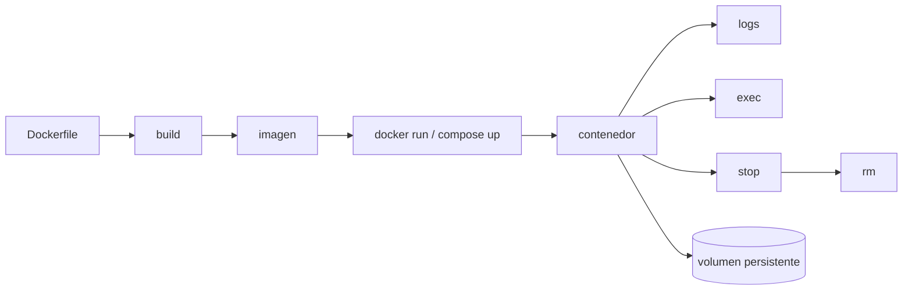

# Docker

Docker resuelve el problema de ejecutar una aplicación con su sistema de archivos, dependencias, variables y proceso principal de forma repetible. En vez de instalar OpenWebUI, Qdrant o LiteLLM directamente en Windows, los ejecutas como contenedores.

## Idea clave

- Imagen: plantilla inmutable con código y dependencias.
- Contenedor: proceso en ejecución creado desde una imagen.
- Volumen: datos persistentes fuera del ciclo de vida del contenedor.
- Red: espacio donde contenedores se encuentran por nombre.
- Puerto: puente entre tu máquina y el proceso dentro del contenedor.

> [!example]
> `docker run -p 8080:80 nginx` significa: publica el puerto 80 del contenedor como puerto 8080 de tu host.

## Comandos esenciales

```bash
docker run hello-world
docker ps
docker ps -a
docker images
docker logs <container>
docker logs -f <container>
docker exec -it <container> sh
docker stop <container>
docker rm <container>
docker compose up -d
docker compose down
docker compose logs -f
docker compose ps
```

## Relación con OpenWebUI oficial + patch

Si la empresa arranca la imagen oficial de [[OpenWebUI]] y aplica un diff propio al inicio, Docker da la base reproducible y el patch introduce personalización. Debes mirar:

- Imagen base exacta.
- Comando/entrypoint.
- Volúmenes montados.
- Script que aplica `git apply` o `patch`.
- Logs de arranque.
- Qué pasa si el patch falla.

## Errores comunes en Windows

- Docker Desktop no está abierto.
- WSL2 no está activo o se ha quedado sin recursos.
- Puerto ocupado por otro proceso.
- Ruta de volumen con espacios o permisos raros.
- CRLF/LF rompe scripts `.sh`.
- Contenedor se cierra porque su proceso principal termina.

## Checklist

- [ ] Sé distinguir imagen y contenedor.
- [ ] Sé publicar puertos.
- [ ] Sé montar volúmenes.
- [ ] Sé leer logs.
- [ ] Sé entrar al contenedor.
- [ ] Sé explicar cómo Docker encaja con [[OpenWebUI_imagen_oficial_mas_patch]].

## Ampliación curso: Docker desde el sistema operativo hacia arriba

Docker no es una máquina virtual completa en el sentido clásico. Es una forma de ejecutar procesos aislados usando una imagen como sistema de archivos base y mecanismos del sistema operativo para aislar procesos, red y recursos. En Windows normalmente Docker Desktop usa WSL2 o una VM ligera por debajo, por eso a veces los errores mezclan Windows, Linux y Docker.

### Ciclo de vida real



### Qué ocurre al ejecutar `docker run nginx`

1. Docker busca la imagen local.
2. Si no existe, la descarga del registry.
3. Crea un contenedor con filesystem, red y proceso principal.
4. Ejecuta el `CMD`/`ENTRYPOINT` definido por la imagen.
5. Mientras ese proceso vive, el contenedor vive.
6. Si el proceso termina, el contenedor queda parado.

### Lectura de problemas

| Síntoma | Qué mirar primero | Causa típica |
|---|---|---|
| No abre localhost | `docker ps`, puertos | puerto no publicado o servicio caído |
| Contenedor sale enseguida | `docker logs` | command termina o error de arranque |
| Pierdo datos | volúmenes | datos escritos dentro del contenedor |
| OpenWebUI no ve Qdrant | red Compose/env vars | URL usa `localhost` dentro del contenedor |
| Patch no aparece | entrypoint/logs/grep | patch no se montó o no aplicó |

### Regla clave de redes

Dentro de un contenedor, `localhost` es el propio contenedor. Si OpenWebUI necesita llamar a Qdrant en el mismo Compose, normalmente debe usar `http://qdrant:6333`, no `http://localhost:6333`.

### Mini examen

- [ ] Explica por qué `docker run -p 8080:80 nginx` no significa que nginx escuche en 8080 dentro.
- [ ] Explica qué se pierde y qué no se pierde al hacer `docker rm`.
- [ ] Explica por qué un volumen es crítico para Qdrant.
- [ ] Explica por qué `docker logs` es más importante que mirar la UI cuando algo no arranca.

## Lección guiada

En Docker, cada concepto debe aterrizar en un comando observable. No basta con decir "contenedor": debes saber verlo, pararlo, inspeccionarlo y leer sus logs.

### Preguntas

- ¿Qué vive en la imagen y qué vive en el contenedor?
- ¿Qué parte se pierde al borrar el contenedor?
- ¿Qué URL usa mi host y qué URL usa otro contenedor?
- ¿Qué log confirma que el servicio arrancó?

### Práctica

```bash
docker ps
docker ps -a
docker logs <container>
docker exec -it <container> sh
docker compose ps
docker compose logs -f
```

### Evidencia

- [ ] He ejecutado al menos un comando relacionado con esta nota.
- [ ] Puedo explicar un fallo típico.
- [ ] Sé cómo conectarlo con [[Docker_para_OpenWebUI_Qdrant_LiteLLM]].
