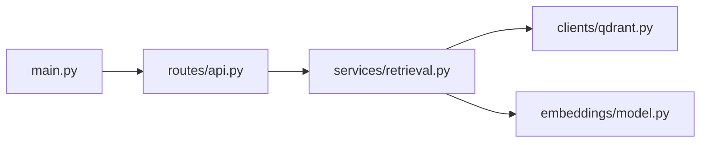

# Cómo leer un repo grande sin IA

Objetivo: orientarte en un repositorio desconocido sin pedirle a un LLM que lo "entienda" entero. La habilidad clave es construir un mapa verificable.

## Proceso en 60-90 minutos

1. Lista raíz.
2. Identifica stack: `package.json`, `pyproject.toml`, `requirements.txt`, `Dockerfile`, `docker-compose.yml`.
3. Encuentra entrypoints.
4. Busca configuración.
5. Busca rutas HTTP, comandos CLI y jobs.
6. Lee tests.
7. Crea `MAPA_REPO.md`.

## Comandos

```bash
rg --files
rg -n "FastAPI|Flask|APIRouter|express|router|click|argparse"
rg -n "QDRANT|OPENAI|LITELLM|VLLM|EMBEDDING|BM25|hybrid"
rg -n "class |def |function "
rg -n "TODO|FIXME|HACK"
```

## Qué poner en MAPA_REPO.md

- Propósito del repo.
- Cómo se arranca.
- Servicios externos.
- Carpetas principales.
- Entry points.
- Config/env vars.
- Flujo principal de datos.
- Tests existentes.
- Zonas peligrosas.
- Dudas abiertas.

## Lectura de imports

Empieza desde el entrypoint y sigue imports propios, no librerías externas. Haz un grafo mental:



> [!warning]
> No abras archivos aleatorios. Cada archivo debe responder una pregunta concreta.

## Ampliación curso: estrategia de lectura por capas

### Capa 1: inventario

No abras archivos todavía. Ejecuta:

```bash
rg --files
```

Clasifica mentalmente:

- configuración
- código fuente
- tests
- scripts
- documentación
- despliegue

### Capa 2: arranque

Busca cómo vive el sistema:

```bash
rg -n "docker compose|uvicorn|gunicorn|npm run|pnpm|poetry|pytest|main"
```

Pregunta: ¿qué comando ejecutaría una persona para levantar esto?

### Capa 3: flujo de negocio

Si el proyecto va de requirements testing, busca palabras del dominio:

```bash
rg -n "requirement|test case|traceability|coverage|qdrant|embedding|bm25|hybrid"
```

### Capa 4: fronteras externas

Busca clientes HTTP, bases de datos, APIs y variables:

```bash
rg -n "http|requests|aiohttp|fetch|OPENAI|QDRANT|LITELLM|VLLM|DATABASE|REDIS"
```

### Capa 5: tests como especificación

Los tests dicen qué comportamiento se consideraba importante. Aunque estén incompletos, son una mina:

```bash
rg -n "describe\(|it\(|pytest|unittest|assert"
```

### Plantilla de preguntas por archivo

Cuando abras un archivo, responde:

- ¿Qué responsabilidad tiene?
- ¿Quién lo llama?
- ¿A quién llama?
- ¿Qué datos entran y salen?
- ¿Qué configuración necesita?
- ¿Qué error produciría si falla?

> [!idea]
> Un buen mapa de repo no resume todos los archivos. Resume las decisiones que necesitarás para modificarlo sin romperlo.

## Lección guiada

En Git/patch/repos, el objetivo es orientarte y controlar cambios. Cada diff debe responder: qué cambia, por qué, dónde y cómo verifico que no se rompió.

### Preguntas

- ¿Qué archivo cambió?
- ¿Qué comportamiento cambia?
- ¿Qué contexto necesita el patch para aplicar?
- ¿Qué comando prueba que aplica limpio?
- ¿Qué búsqueda con `rg` confirma el cambio?

### Práctica

```bash
git diff
git show <commit>
git apply --check changes.patch
rg -n "qdrant|bm25|hybrid|patch|entrypoint"
```

### Evidencia

- [ ] Puedo crear o leer un patch.
- [ ] Puedo explicar un fallo de hunk.
- [ ] Puedo añadir una entrada útil a un `MAPA_REPO.md`.
