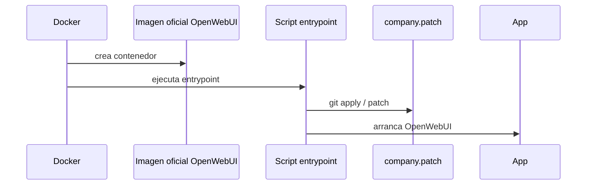

# Curso Git, patch y repos grandes

## 1. Por que Git importa aqui

Tu caso no es solo "usar Git para subir codigo". Es entender una modificacion empresarial sobre un proyecto existente. Cuando te dicen que usan la imagen oficial de [[OpenWebUI]] pero aplican un diff al arrancar, te estan diciendo:

```text
base externa + cambios propios = comportamiento real de empresa
```

Para entender eso necesitas dominar:

- commits;
- diffs;
- patches;
- ramas/tags;
- busqueda en repos grandes;
- comparacion contra una base.

## 2. `git diff`: que ha cambiado en mi working tree

`git diff` muestra cambios no staged:

```bash
git diff
```

`git diff --cached` muestra lo que ya esta preparado para commit:

```bash
git diff --cached
```

Un diff tiene esta estructura:

```diff
diff --git a/file.py b/file.py
--- a/file.py
+++ b/file.py
@@ -1,3 +1,4 @@
 old line
+new line
```

La cabecera dice el archivo. Las lineas con `+` se añaden. Las lineas con `-` se eliminan. El bloque `@@` dice la zona aproximada.

## 3. Patch: un diff como archivo transportable

Un patch es un diff guardado en un archivo:

```bash
git diff > changes.patch
```

Luego se puede aplicar:

```bash
git apply changes.patch
```

Antes de aplicar:

```bash
git apply --check changes.patch
```

Eso responde: "este patch encaja en esta version del codigo?"

## 4. Que significa aplicar un diff al arrancar un contenedor

En un contenedor, el filesystem nace desde la imagen. Si montas un patch y lo aplicas al inicio, estas modificando archivos dentro del contenedor antes de ejecutar la aplicacion.



Esto es util si quieres seguir una imagen oficial pero modificar partes concretas. Tambien es fragil si no controlas la version exacta.

## 5. El problema de comparar contra `main`

Si comparas el repo de tu jefe contra el `main` actual de OpenWebUI, el diff puede ser enorme porque:

- el repo puede estar en otro commit;
- upstream puede haber avanzado;
- hay archivos generados;
- puede haber cambios de dependencias no relacionados con la empresa.

Para extraer el patch real necesitas:

- commit/tag exacto de la imagen oficial;
- commit del repo modificado;
- o patch original usado en Docker.

Sin eso, solo puedes hacer analisis orientativo.

## 6. Como leer un repo grande sin IA

No empieces leyendo archivos aleatorios. Sigue este orden:

1. `README.md`: como se supone que arranca.
2. `docker-compose.yml`: servicios reales.
3. `pyproject.toml`, `package.json`, `requirements.txt`: stack.
4. carpetas principales: backend, frontend, config.
5. busqueda por palabras clave.
6. endpoints/routers.
7. flujo desde entrada hasta salida.

Comandos:

```bash
rg -n "qdrant|bm25|hybrid|rerank|embedding" .
rg -n "chat/completions|openai|litellm|vllm" .
rg -n "Config|ENV|os.getenv" backend
rg --files | rg "docker|compose|requirements|pyproject|package"
```

## 7. Mapa de repo

Tu `MAPA_REPO.md` debe tener:

- commit analizado;
- como se arranca;
- dependencias clave;
- carpetas principales;
- flujo de una peticion;
- archivos que contienen logica importante;
- dudas abiertas.

Plantilla:

```md
# MAPA_REPO

## Commit

## Como arranca

## Servicios Docker

## Backend

## Frontend

## Retrieval

## Inferencia

## Configuracion

## Dudas abiertas
```

## 8. Ejercicio de patch roto

1. Crea un archivo:

```bash
mkdir patch-demo
cd patch-demo
git init
echo "version=1" > app.txt
git add .
git commit -m "base"
```

2. Cambia:

```bash
echo "version=2" > app.txt
git diff > changes.patch
git checkout -- app.txt
git apply --check changes.patch
git apply changes.patch
```

3. Rompe el contexto:

```bash
echo "version=base-changed" > app.txt
git apply --check changes.patch
```

Debes observar que el patch ya no encaja igual.

## 9. Autocomprobacion

- [ ] Puedo leer un diff sin miedo.
- [ ] Puedo explicar que hace `git apply --check`.
- [ ] Puedo explicar por que un patch depende de la version base.
- [ ] Puedo crear un `MAPA_REPO.md`.
- [ ] Puedo buscar en un repo grande con `rg`.
- [ ] Puedo explicar por que `_repos/` no debe commitearse dentro de la bóveda.

