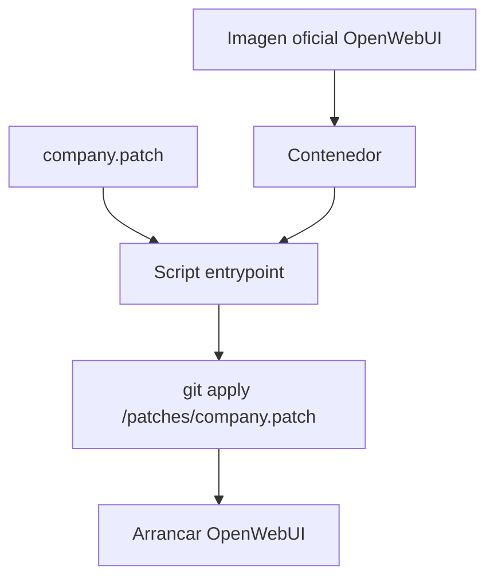

# OpenWebUI Patch al Arrancar

La idea: usar la imagen oficial de [[OpenWebUI]] y aplicar cambios propios cuando el contenedor arranca.



## Qué buscar

- `entrypoint.sh`
- `start.sh`
- `command:` en `docker-compose.yml`
- volumen que monte `/patches`
- uso de `git apply`, `patch`, `cp`, `sed`
- logs al inicio

## Comprobaciones

```bash
docker compose logs -f openwebui
docker compose exec openwebui sh
grep -R "hybrid_search" /app/backend/open_webui -n
grep -R "bm25" /app/backend/open_webui -n
grep -R "qdrant" /app/backend/open_webui -n
```

## Riesgos de actualización

Si sube la versión de la imagen oficial, los archivos destino pueden cambiar. Entonces:

- `git apply --check` falla.
- El patch aplica con offset pero no donde esperas.
- La funcionalidad interna cambia de nombre.
- Los tests de arranque pasan pero el flujo RAG falla.

> [!todo]
> Cada patch propio debería tener una nota: qué archivo toca, por qué, cómo se comprueba y qué test lo cubre.

## Lección guiada

En Git/patch/repos, el objetivo es orientarte y controlar cambios. Cada diff debe responder: qué cambia, por qué, dónde y cómo verifico que no se rompió.

### Preguntas

- ¿Qué archivo cambió?
- ¿Qué comportamiento cambia?
- ¿Qué contexto necesita el patch para aplicar?
- ¿Qué comando prueba que aplica limpio?
- ¿Qué búsqueda con `rg` confirma el cambio?

### Práctica

```bash
git diff
git show <commit>
git apply --check changes.patch
rg -n "qdrant|bm25|hybrid|patch|entrypoint"
```

### Evidencia

- [ ] Puedo crear o leer un patch.
- [ ] Puedo explicar un fallo de hunk.
- [ ] Puedo añadir una entrada útil a un `MAPA_REPO.md`.
