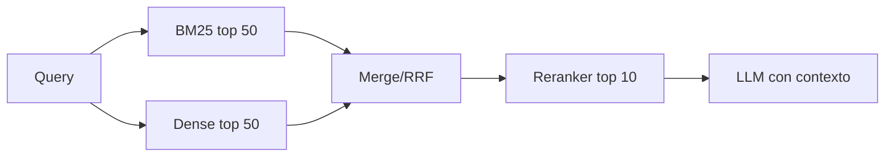

# Curso embeddings, RAG y Qdrant desde cero

## 1. El problema

Si tienes miles de requisitos y tests, no puedes leerlos todos cada vez. Necesitas recuperar los mas relevantes para una pregunta:

```text
Que requisitos hablan de unsupported DID y NRC 0x31?
```

Hay dos familias de busqueda:

- lexical/sparse: busca palabras exactas o muy parecidas;
- semantica/densa: busca significado aproximado.

## 2. BM25

BM25 puntua documentos segun:

- terminos compartidos con la query;
- rareza de esos terminos;
- longitud del documento.

Es muy bueno para:

- `UDS`;
- `0x22`;
- `NRC`;
- `DID`;
- nombres de señales;
- codigos exactos.

Es peor si la relacion se expresa con palabras distintas.

## 3. Embeddings densos

Un embedding convierte texto en vector:

```text
"unsupported DID" -> [0.12, -0.08, ...]
```

Textos semanticamente cercanos deberian tener vectores cercanos.

Para comparar se usa a menudo cosine similarity:

```text
cos(a,b) = (a dot b) / (||a|| ||b||)
```

Problema: el embedding puede entender parafrasis, pero puede perder importancia de IDs exactos.

## 4. Thresholds

Un threshold decide si aceptas o no una coincidencia:

```text
si similarity >= 0.75 -> candidato relevante
```

Subir threshold:

- menos falsos positivos;
- mas falsos negativos.

Bajar threshold:

- mas recall;
- mas ruido.

> [!idea]
> En requirements/testing suele interesar recall alto al principio: prefieres revisar candidatos de mas antes que perder una contradiccion importante.

## 5. Hybrid search

Hybrid search mezcla BM25 y embeddings.

```text
score = alpha * dense + (1 - alpha) * sparse
```

Pero la suma simple tiene un problema: los scores no siempre son comparables. Por eso se usan normalizaciones o RRF.

## 6. RRF

RRF combina rankings por posicion:

```text
RRF(d) = sum(1 / (k + rank_i(d)))
```

No necesita que BM25 y dense compartan escala. Si un documento aparece alto en ambos rankings, sube.

## 7. Reranking

Una arquitectura comun:



El reranker es mas caro, pero evalua pares query-documento con mas detalle.

## 8. Qdrant

Qdrant guarda vectores y payload:

```json
{
  "id": "REQ-001",
  "vector": [0.1, 0.2, ...],
  "payload": {
    "module": "diagnostics",
    "domain": "UDS",
    "text": "The ECU shall support..."
  }
}
```

Conceptos:

- collection: conjunto de points;
- point: vector + payload + id;
- payload: metadata filtrable;
- filter: condicion sobre metadata;
- top-k: numero de candidatos recuperados.

## 9. Evaluacion

Mide contra golden set:

| Metrica | Pregunta |
|---|---|
| precision@k | De los top-k, cuantos son correctos? |
| recall@k | De los relevantes, cuantos encontre? |
| MRR | En que posicion aparece el primer correcto? |
| NDCG | Ordene bien varios relevantes? |

No optimices alpha, threshold o modelo sin golden set.

## 10. Practica minima

Ejecuta:

```bash
python 13_Labs/code/requirements_dataset.py
python 13_Labs/code/embedding_thresholds.py
python 13_Labs/code/bm25_hybrid.py
```

Luego levanta Qdrant:

```bash
docker run -p 6333:6333 -p 6334:6334 qdrant/qdrant
python 13_Labs/code/qdrant_index_search.py
```

## 11. Autocomprobacion

- [ ] Puedo explicar BM25 con mis palabras.
- [ ] Puedo explicar por que embeddings fallan con codigos exactos.
- [ ] Puedo explicar falso positivo y falso negativo.
- [ ] Puedo explicar top-k y threshold.
- [ ] Puedo explicar collection, point y payload.
- [ ] Puedo proponer metadata util para requisitos de automocion.

