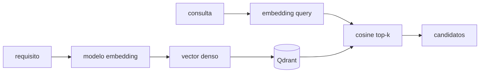

# Embeddings para requisitos

Un embedding denso convierte texto en un vector numérico. Requisitos parecidos deberían quedar cerca en el espacio vectorial.

## Conceptos

- Dense retrieval: búsqueda por vectores densos.
- Similarity search: encontrar vecinos cercanos.
- Cosine similarity: mide ángulo, no longitud.
- Top-k: devuelve los k resultados más cercanos.
- Threshold: mínimo de similitud para aceptar relación.

## Ejemplo conceptual

REQ A: "The ECU shall support UDS service 0x22"

REQ B: "The diagnostic module shall read DID values"

Aunque no compartan muchas palabras exactas, un buen embedding puede acercarlos por semántica.

## Riesgo

> [!warning]
> Un embedding puede juntar textos que suenan parecidos pero tienen condiciones opuestas. Por eso necesitas [[Golden_Set_para_evaluar_retrieval]].

## Ampliación curso: qué aprende y qué no aprende un embedding

Un embedding comprime texto en un vector. Esa compresión pierde información. Por eso dos requisitos con una negación crítica pueden quedar cerca:

- "shall accept supported DID"
- "shall reject unsupported DID"

Son semánticamente relacionados, pero no equivalentes. Para testing, esa diferencia importa.

### Pipeline mínimo



### Cosine similarity intuitiva

La similitud coseno compara dirección. Si normalizas vectores, el producto punto ya equivale a coseno. Muchos sistemas normalizan embeddings para simplificar ranking.

### Errores típicos con requisitos

- Textos largos mezclan varias obligaciones.
- Siglas raras no se representan bien.
- Números y códigos hexadecimales pueden perder peso.
- Negaciones y condiciones cambian el sentido.
- Requisitos de módulos distintos comparten vocabulario genérico.

### Buenas prácticas

- Chunk por requisito atómico.
- Guarda metadata: módulo, versión, fuente, estado.
- Evalúa con golden set.
- Combina con BM25 para tokens exactos.
- No conviertas top-1 en verdad.

## Lección guiada

En retrieval, no te conformes con obtener resultados. Pregunta si son correctos, por qué aparecen y qué errores producen.

### Preguntas

- ¿La coincidencia es semántica, lexical o por metadata?
- ¿Qué pasaría si subo el threshold?
- ¿Qué candidato es falso positivo?
- ¿Qué relevante falta en top-k?
- ¿Qué filtro reduciría ruido?

### Práctica

```bash
python 13_Labs/code/embedding_thresholds.py
python 13_Labs/code/bm25_hybrid.py
python 13_Labs/code/qdrant_index_search.py
```

### Evidencia

- [ ] He comparado BM25 contra embeddings.
- [ ] He encontrado al menos un falso positivo.
- [ ] Sé explicar qué guarda Qdrant además del vector.
