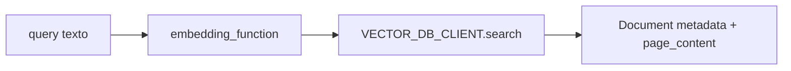

# Análisis código hybrid search javilima01

Esta nota explica el flujo de código más relevante del repo `javilima01/open-webui` para RAG, BM25, Qdrant e hybrid search.

Repo local:

- `_repos/open-webui-javilima01`

## 1. Configuración: `config.py`

Archivo:

`_repos/open-webui-javilima01/backend/open_webui/config.py`

Líneas relevantes localizadas:

- `VECTOR_DB`: línea aproximada `2124`.
- `QDRANT_URI`: línea aproximada `2171`.
- `QDRANT_COLLECTION_PREFIX`: línea aproximada `2181`.
- `RAG_HYBRID_BM25_WEIGHT`: línea aproximada `2674`.
- `ENABLE_RAG_HYBRID_SEARCH`: línea aproximada `2680`.
- `ENABLE_RAG_HYBRID_SEARCH_ENRICHED_TEXTS`: línea aproximada `2686`.

## Qué significa

OpenWebUI no decide usar Qdrant o hybrid search por magia. Lo hace por configuración:

```text
VECTOR_DB=qdrant
QDRANT_URI=http://qdrant:6333
ENABLE_RAG_HYBRID_SEARCH=true
RAG_HYBRID_BM25_WEIGHT=0.5
ENABLE_RAG_HYBRID_SEARCH_ENRICHED_TEXTS=true
```

Si `VECTOR_DB` queda en `chroma`, Qdrant no se usa aunque esté levantado.

Si `ENABLE_RAG_HYBRID_SEARCH` no está activo, se usa búsqueda vectorial normal.

## 2. Carga en estado de la app: `main.py`

Archivo:

`_repos/open-webui-javilima01/backend/open_webui/main.py`

Líneas relevantes:

- `HYBRID_BM25_WEIGHT`: línea aproximada `841`.
- `ENABLE_RAG_HYBRID_SEARCH`: línea aproximada `853`.
- `ENABLE_RAG_HYBRID_SEARCH_ENRICHED_TEXTS`: línea aproximada `854`.

`app.state.config` es el sitio desde el que routers y middleware leen la configuración viva.

## 3. Cliente Qdrant

Archivo:

`_repos/open-webui-javilima01/backend/open_webui/retrieval/vector/dbs/qdrant.py`

La clase `QdrantClient` envuelve el cliente oficial de Qdrant.

Responsabilidades:

- crear cliente HTTP/gRPC;
- crear colecciones con distancia coseno;
- crear índices de payload para `metadata.hash` y `metadata.file_id`;
- convertir points de Qdrant a `GetResult`;
- insertar/upsert points;
- hacer `search`;
- hacer `query` por filtros;
- borrar/resetear colecciones.

Cada point se guarda como:

```python
payload={
    "text": item["text"],
    "metadata": item["metadata"],
}
```

Esto significa que el vector no basta. El texto original y la metadata son necesarios para mostrar evidencia, filtrar, construir BM25, deduplicar y explicar resultados.

## 4. Retrieval base: `VectorSearchRetriever`

Archivo:

`_repos/open-webui-javilima01/backend/open_webui/retrieval/utils.py`

Línea aproximada:

- `class VectorSearchRetriever`: `88`.

Qué hace:

1. Recibe una query.
2. Genera embedding con `embedding_function`.
3. Llama a `VECTOR_DB_CLIENT.search`.
4. Convierte resultados a objetos `Document` de LangChain.



## 5. Textos enriquecidos para BM25

Función:

- `get_enriched_texts`: línea aproximada `155`.

Para cada chunk, construye un texto más rico para BM25:

- texto del chunk;
- filename repetido y tokenizado;
- title;
- headings;
- source;
- snippet.

BM25 funciona con tokens. Si el chunk no contiene nombre de archivo, sección o fuente, BM25 no puede usar esa señal lexical. Enriquecer el texto puede ayudar a que consultas como `manual UDS NRC` encuentren chunks cuya metadata sí contiene señales útiles.

> [!warning]
> Enriquecer texto mejora recall lexical, pero también puede meter ruido. Debe evaluarse con [[Golden_Set_para_evaluar_retrieval]].

## 6. Hybrid search por documento

Función:

- `query_doc_with_hybrid_search`: línea aproximada `193`.

Flujo:

1. Comprueba que la colección tiene documentos y metadata.
2. Decide si BM25 usa texto normal o texto enriquecido.
3. Crea `BM25Retriever.from_texts`.
4. Crea `VectorSearchRetriever`.
5. Combina ambos con `EnsembleRetriever`.
6. Aplica `RerankCompressor`.
7. Devuelve `distances`, `documents`, `metadatas`.

La lógica del peso:

```text
hybrid_bm25_weight <= 0  -> solo vector
hybrid_bm25_weight >= 1  -> solo BM25
0 < weight < 1           -> BM25 + vector
```

## 7. Hybrid search por colecciones

Función:

- `query_collection_with_hybrid_search`: línea aproximada `442`.

Añade:

- varias colecciones;
- `VECTOR_DB_CLIENT.get` una vez por colección;
- tareas async para cada combinación colección/query;
- fusión de resultados con `merge_and_sort_query_results`.

## 8. Entrada desde el flujo de chat

Archivo:

`_repos/open-webui-javilima01/backend/open_webui/utils/middleware.py`

Líneas relevantes:

- `hybrid_bm25_weight=request.app.state.config.HYBRID_BM25_WEIGHT`: línea aproximada `1016`.
- `hybrid_search=request.app.state.config.ENABLE_RAG_HYBRID_SEARCH`: línea aproximada `1017`.

Esto significa que el flujo normal de chat pasa la configuración RAG al retrieval.

## 9. `get_sources_from_items`

Archivo:

`_repos/open-webui-javilima01/backend/open_webui/retrieval/utils.py`

Zona aproximada:

- empieza cerca de `900`;
- llamada a `query_collection_with_hybrid_search` cerca de `1123`.

Esta función traduce "cosas adjuntas al chat" en fuentes:

- texto pegado;
- nota;
- chat;
- URL;
- archivo;
- colección/knowledge base;
- colección directa.

Después decide entre full context, hybrid search y vector search normal.

## 10. UI de administración

Archivo:

`_repos/open-webui-javilima01/src/lib/components/admin/Settings/Documents.svelte`

Líneas relevantes:

- `Hybrid Search`: cerca de `1150`.
- `Enrich Hybrid Search Text`: cerca de `1165`.
- `Top K Reranker`: cerca de `1245`.
- `Relevance Threshold`: cerca de `1261`.
- `BM25 Weight`: cerca de `1290`.

La UI permite configurar sin tocar env vars:

- activar hybrid;
- activar enriched text;
- elegir reranker;
- ajustar top-k reranker;
- ajustar threshold;
- ajustar peso BM25.

## 11. Punto a revisar: fallback cuando hybrid falla

En `get_sources_from_items`, el comentario dice:

```text
Error when using hybrid search, using non hybrid search as fallback.
```

Pero la condición posterior es:

```python
if not hybrid_search and query_result is None:
    query_result = await query_collection(...)
```

Si `hybrid_search` es `True` y la búsqueda híbrida falla, `not hybrid_search` es `False`, así que esa rama no ejecuta fallback vectorial. Puede que haya otra capa de fallback o que sea intencional, pero como lectura de código es una zona a preguntar o testear.

> [!todo]
> Crear un test manual: activar hybrid search, forzar fallo de BM25/reranker y comprobar si cae a vector search o devuelve sin fuentes.

## 12. Qué deberías ser capaz de explicar

- [ ] Qué variable activa hybrid search.
- [ ] Qué significa `RAG_HYBRID_BM25_WEIGHT`.
- [ ] Cómo se construye BM25.
- [ ] Cómo se combina BM25 con vector search.
- [ ] Para qué sirve reranking.
- [ ] Por qué enriched text puede ayudar.
- [ ] Qué papel tiene Qdrant.
- [ ] Cómo llega la configuración desde UI hasta middleware.
- [ ] Qué falla si Qdrant no está levantado.
- [ ] Qué falla si el embedding model de query no coincide con los vectores indexados.

