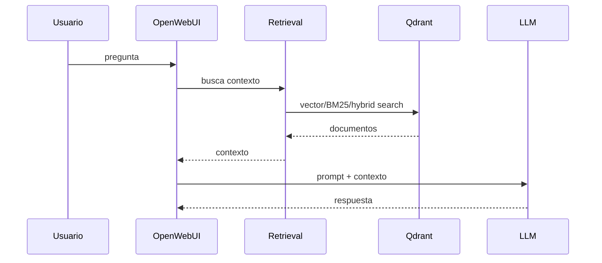

# Curso OpenWebUI, patch de empresa y analisis del repo

## 1. Que papel juega OpenWebUI

OpenWebUI es la interfaz donde el usuario habla con modelos y usa funcionalidades como RAG. En tu arquitectura mental, no es "el modelo"; es la aplicacion que coordina UI, backend, documentos, retrieval y llamadas a APIs de modelos.

```text
Usuario -> OpenWebUI -> retrieval -> modelo -> respuesta
```

## 2. Backend y frontend

A alto nivel:

- frontend: pantallas, settings, botones, formularios;
- backend: endpoints, configuracion, RAG, conectores, llamadas a modelos.

Cuando una opcion aparece en la UI, casi siempre existe:

- estado frontend;
- endpoint backend;
- variable/configuracion;
- logica que usa esa configuracion.

Por eso para entender `hybrid_search` no basta con buscar en una pantalla. Hay que seguir el flujo.

## 3. RAG en OpenWebUI

RAG significa que antes de llamar al modelo se recuperan documentos relevantes y se añaden al contexto.

Flujo simplificado:



## 4. Imagen oficial + patch

La empresa puede preferir imagen oficial porque:

- reduce mantenimiento;
- facilita actualizaciones;
- mantiene compatibilidad con upstream;
- evita publicar una imagen custom completa.

El patch añade cambios propios:

- hybrid search;
- BM25;
- enriquecimiento de textos;
- integracion Qdrant;
- ajustes de UI;
- configuracion interna.

## 5. Como comprobar si esta parcheado

Dentro del contenedor:

```bash
grep -R "hybrid_search" /app/backend/open_webui -n
grep -R "bm25" /app/backend/open_webui -n
grep -R "qdrant" /app/backend/open_webui -n
```

Si no aparece nada:

- el patch no se aplico;
- estas mirando otra ruta;
- la version usa otros nombres;
- el contenedor no es el correcto.

## 6. Analisis del repo `javilima01/open-webui`

En la bóveda tienes:

- [[Repo_javilima01_OpenWebUI]]
- [[Analisis_codigo_hybrid_search_javilima01]]
- [[Como_convertir_repo_javilima01_en_patch_empresa]]

La idea es usar ese repo como caso real de lectura:

1. localizar dependencias (`qdrant-client`, `rank-bm25`);
2. localizar variables de configuracion;
3. seguir routers/endpoints;
4. seguir funciones de retrieval;
5. buscar UI de settings;
6. detectar puntos fragiles.

## 7. Preguntas buenas para la empresa

- Que imagen oficial exacta se usa?
- Que tag o digest?
- Donde esta el patch?
- Se aplica con `git apply`, `patch` o copia de archivos?
- Que pasa si falla?
- Hay test automatico del patch?
- Se recompila frontend?
- Se versiona el patch junto al compose?
- Como se comprueba que `hybrid_search` esta activo?

## 8. Riesgos reales

| Riesgo | Sintoma | Mitigacion |
|---|---|---|
| patch no aplica | logs con failed hunk | `git apply --check` en CI |
| patch aplica parcial | feature falta en runtime | `set -e`, comprobaciones post-arranque |
| base cambia | diff enorme | fijar tag/digest |
| frontend no actualizado | UI no muestra opcion | build controlado |
| config no persistente | se pierde al recrear | volumen/env vars |

## 9. Autocomprobacion

- [ ] Puedo explicar OpenWebUI sin llamarlo "el modelo".
- [ ] Puedo distinguir UI, backend, retrieval y provider LLM.
- [ ] Puedo buscar `hybrid_search`, `bm25` y `qdrant` en el contenedor.
- [ ] Puedo explicar por que hace falta saber la version base exacta.
- [ ] Puedo leer una ruta de codigo desde setting UI hasta funcion backend.

