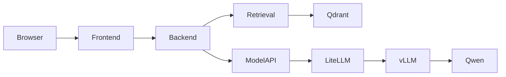

# OpenWebUI Arquitectura

OpenWebUI suele combinar frontend, backend y conectores a modelos/vector DB. No lo leas como una caja única: sepáralo por responsabilidades.

## Conecta con
- [[OpenWebUI]]
- [[OpenWebUI_RAG]]
- [[Arquitectura_OpenWebUI_LiteLLM_vLLM_Qwen]]

## Diagrama


## Qué mirar
Rutas backend, configuración, servicios RAG, clientes de vector DB y llamadas OpenAI-compatible.

## Checklist
- [ ] Puedo explicar el concepto sin leer la nota.
- [ ] He ejecutado al menos un comando o ejercicio relacionado.
- [ ] He escrito una duda concreta en [[Diario_Estudio_Template]].

## Lección guiada

En OpenWebUI, separa interfaz, backend, retrieval, configuración y modelo. Cuando algo falla, ubica primero en qué tramo está el fallo.

### Preguntas

- ¿OpenWebUI llama al modelo directamente o vía LiteLLM?
- ¿Dónde está configurado Qdrant?
- ¿El patch se aplicó realmente?
- ¿Qué logs muestran retrieval?
- ¿Qué grep confirma símbolos propios?

### Práctica

```bash
docker compose logs -f openwebui
grep -R "hybrid_search" /app/backend/open_webui -n
grep -R "bm25" /app/backend/open_webui -n
grep -R "qdrant" /app/backend/open_webui -n
```

### Evidencia

- [ ] Puedo dibujar OpenWebUI -> Qdrant -> modelo.
- [ ] Puedo explicar imagen oficial + patch.
- [ ] Puedo hacer una checklist de inspección.
