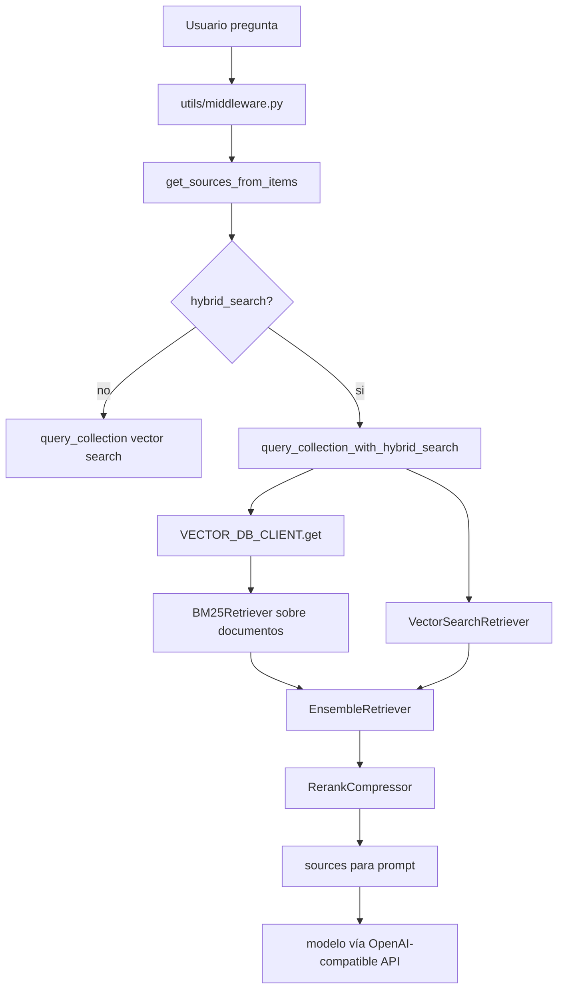

# Repo javilima01 OpenWebUI

Repositorio:

- GitHub: https://github.com/javilima01/open-webui
- Clon local de estudio: `_repos/open-webui-javilima01`
- Upstream oficial clonado para comparación orientativa: `_repos/open-webui-upstream`

> [!warning]
> La comparación contra `open-webui/open-webui` actual es ruidosa porque las cabezas clonadas no parecen representar la misma base exacta. Para reconstruir el patch real de empresa necesitas el tag o commit de la imagen oficial usada por el contenedor.

## Qué contiene este repo

Es un fork/copia de OpenWebUI con zonas relevantes para tu proyecto:

- [[OpenWebUI_RAG]]
- [[OpenWebUI_con_Qdrant]]
- [[Hybrid_Search]]
- [[BM25]]
- [[Qdrant]]
- [[OpenAI_Compatible_API]]
- configuración de embeddings
- UI de administración para documentos/RAG

## Mapa rápido de carpetas

| Ruta | Qué mirar |
|---|---|
| `_repos/open-webui-javilima01/backend/open_webui/config.py` | variables y `PersistentConfig`; aquí aparecen `VECTOR_DB`, `QDRANT_URI`, hybrid search y pesos BM25 |
| `_repos/open-webui-javilima01/backend/open_webui/main.py` | carga configs en `app.state.config` |
| `_repos/open-webui-javilima01/backend/open_webui/retrieval/utils.py` | núcleo de retrieval: vector search, BM25, hybrid, reranking |
| `_repos/open-webui-javilima01/backend/open_webui/routers/retrieval.py` | API de configuración RAG y endpoints de query |
| `_repos/open-webui-javilima01/backend/open_webui/utils/middleware.py` | integración RAG en el flujo de chat |
| `_repos/open-webui-javilima01/backend/open_webui/retrieval/vector/dbs/qdrant.py` | cliente Qdrant |
| `_repos/open-webui-javilima01/src/lib/components/admin/Settings/Documents.svelte` | UI admin para activar hybrid search, enriched text y peso BM25 |
| `_repos/open-webui-javilima01/docker-compose.yaml` | Compose básico con Ollama + OpenWebUI |
| `_repos/open-webui-javilima01/Dockerfile` | imagen y variables por defecto |

## Qué parece importante para Technica

El repo encaja con lo que te contaron:

1. OpenWebUI como interfaz.
2. Docker como forma de arranque.
3. Qdrant como vector DB opcional.
4. BM25 e hybrid search como mejora de retrieval.
5. Reranking para reordenar candidatos.
6. Embeddings OpenAI-compatible/Ollama/internos.
7. UI para tocar parámetros sin editar código.

## Señales concretas encontradas

### Dependencias

En `pyproject.toml` y `backend/requirements.txt` aparecen:

- `rank-bm25==0.2.2`
- `qdrant-client==1.14.3`
- `langchain==0.3.27`
- `langchain-community==0.3.29`

Esto explica por qué el código puede construir un `BM25Retriever`, usar `QdrantClient` y combinar retrievers con LangChain.

### Configuración

En `backend/open_webui/config.py`:

- `VECTOR_DB` se lee de entorno.
- `QDRANT_URI`, `QDRANT_API_KEY`, `QDRANT_COLLECTION_PREFIX` configuran Qdrant.
- `RAG_HYBRID_BM25_WEIGHT` define peso lexical.
- `ENABLE_RAG_HYBRID_SEARCH` activa búsqueda híbrida.
- `ENABLE_RAG_HYBRID_SEARCH_ENRICHED_TEXTS` activa enriquecimiento textual para BM25.

### UI

En `src/lib/components/admin/Settings/Documents.svelte` aparece una sección visual para:

- activar `Hybrid Search`;
- activar `Enrich Hybrid Search Text`;
- elegir reranking engine/model;
- ajustar `Top K Reranker`;
- ajustar `Relevance Threshold`;
- ajustar `BM25 Weight`, con escala semántico -> lexical.

## Diagrama de flujo

## Qué estudiar primero en este repo

1. `backend/open_webui/retrieval/utils.py`
2. `backend/open_webui/routers/retrieval.py`
3. `backend/open_webui/config.py`
4. `src/lib/components/admin/Settings/Documents.svelte`
5. `backend/open_webui/retrieval/vector/dbs/qdrant.py`
6. `backend/open_webui/utils/middleware.py`

## Preguntas para tu jefe/equipo

- [ ] ¿Qué tag/commit oficial de OpenWebUI usa la imagen Docker base?
- [ ] ¿El patch de empresa es literalmente el diff entre ese tag y `javilima01/open-webui`?
- [ ] ¿Qué archivos toca el patch realmente?
- [ ] ¿El patch se aplica con `git apply`, `patch`, `cp` o script propio?
- [ ] ¿Qué variables están activadas en producción?
- [ ] ¿Usan `ENABLE_RAG_HYBRID_SEARCH=true`?
- [ ] ¿Qué valor usan para `RAG_HYBRID_BM25_WEIGHT`?
- [ ] ¿Usan Qdrant en modo multitenancy?
- [ ] ¿Qué embedding model genera los vectores existentes?
- [ ] ¿Hay golden set para validar que hybrid search mejora?

## Cómo seguir

Lee ahora [[Analisis_codigo_hybrid_search_javilima01]] y después [[Como_convertir_repo_javilima01_en_patch_empresa]].

