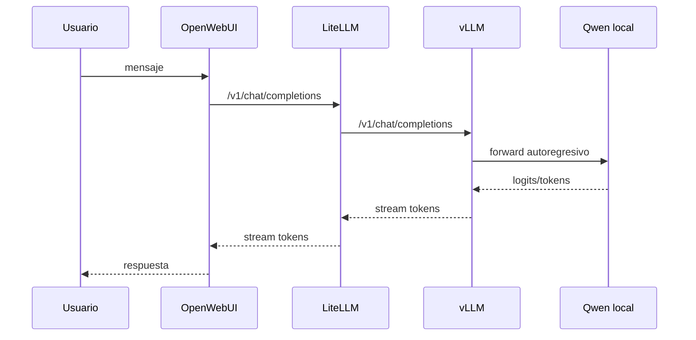

# Arquitectura OpenWebUI LiteLLM vLLM Qwen



## Checklist de empresa

- [ ] Qué modelo Qwen.
- [ ] Qué context length.
- [ ] Qué cuantización.
- [ ] Qué GPU.
- [ ] Qué puerto.
- [ ] Si hay streaming.
- [ ] Si LiteLLM está en medio.
- [ ] Dónde están logs de vLLM.
- [ ] Qué endpoint usa OpenWebUI.

## Lección guiada

En inferencia, distingue modelo, servidor, gateway y cliente. Muchos errores parecen "del modelo" pero son de endpoint, streaming, memoria o configuración.

### Preguntas

- ¿Quién expone `/v1/chat/completions`?
- ¿Qué modelo real hay detrás del nombre?
- ¿Hay LiteLLM entre OpenWebUI y vLLM?
- ¿La lentitud está en prefill o decode?
- ¿Qué consume KV cache?

### Práctica

```bash
curl http://localhost:8000/v1/models
curl http://localhost:8000/v1/chat/completions
```

### Evidencia

- [ ] Puedo explicar KV cache.
- [ ] Puedo explicar batching y streaming.
- [ ] Sé qué preguntar sobre Qwen local.
