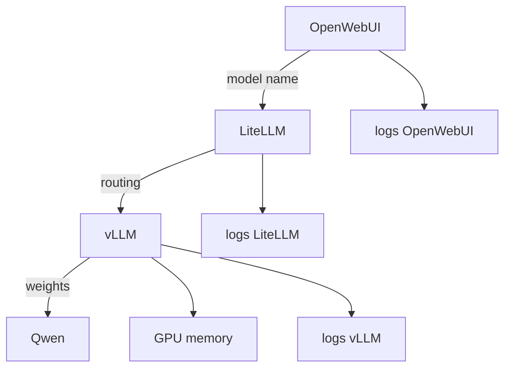

# Curso inferencia, vLLM, LiteLLM y Qwen desde cero

## 1. Modelo no es motor

Un modelo es el conjunto de pesos y arquitectura. Un motor de inferencia es el software que ejecuta esos pesos para responder peticiones.

```text
Qwen = modelo
vLLM = motor/servidor que ejecuta el modelo
LiteLLM = gateway/proxy que unifica APIs
OpenWebUI = cliente/UI
```

Confundir esto genera diagnosticos malos. Si algo falla, puede fallar:

- el modelo;
- la memoria GPU;
- el servidor vLLM;
- el proxy LiteLLM;
- la URL configurada en OpenWebUI;
- el streaming;
- el timeout.

## 2. API OpenAI-compatible

Muchas herramientas hablan el formato de OpenAI:

```http
POST /v1/chat/completions
```

Ejemplo:

```bash
curl http://localhost:8000/v1/chat/completions \
  -H "Content-Type: application/json" \
  -d '{
    "model": "qwen-local",
    "messages": [
      {"role": "user", "content": "Explica UDS 0x22"}
    ],
    "stream": false
  }'
```

Si vLLM expone esa API, OpenWebUI puede tratarlo como proveedor compatible.

## 3. LiteLLM

LiteLLM puede actuar como capa intermedia:

```text
OpenWebUI -> LiteLLM -> vLLM -> Qwen
```

Ventajas:

- unifica proveedores;
- centraliza claves;
- permite routing;
- logs/costes/limits;
- fallback entre modelos.

Coste:

- otra capa que puede estar mal configurada;
- streaming puede romperse si el proxy bufferiza;
- nombres de modelo pueden no coincidir con el backend real.

## 4. vLLM

vLLM esta pensado para servir LLMs eficientemente. Sus ideas clave:

- batching continuo;
- gestion eficiente de KV cache;
- OpenAI-compatible server;
- soporte de streaming;
- uso intensivo de GPU.

## 5. KV cache

En un modelo autoregresivo, generar token por token exige atender al contexto previo. La KV cache guarda claves y valores ya calculados.

Sin cache:

```text
para cada token nuevo, recalculo todo el contexto
```

Con cache:

```text
calculo lo nuevo y reutilizo K/V anteriores
```

Tradeoff: acelera, pero consume memoria.

## 6. Prefill vs decode

Dos fases:

- prefill: procesar prompt/contexto inicial;
- decode: generar tokens nuevos.

Si metes mucho contexto RAG, el prefill puede ser caro. Si generas respuestas largas para muchos usuarios, decode y KV cache dominan.

## 7. Latencia y throughput

No digas solo "va lento". Separa:

| Metrica | Significado |
|---|---|
| TTFT | tiempo hasta primer token |
| tokens/s | velocidad de generacion |
| throughput | peticiones/tokens por unidad de tiempo |
| queue time | espera antes de entrar en GPU |
| OOM | memoria insuficiente |

## 8. Qwen local

Preguntas imprescindibles:

- Que variante de Qwen?
- Cuantos parametros?
- Instruct o base?
- Cuanto contexto?
- Cuantizacion?
- GPU usada?
- VRAM?
- Template de chat?
- Limites de tokens?

## 9. Arquitectura de diagnostico



Si falla una respuesta:

1. prueba `/v1/models` en vLLM;
2. prueba `chat/completions` directo a vLLM;
3. prueba pasando por LiteLLM;
4. prueba desde OpenWebUI;
5. compara logs.

## 10. Autocomprobacion

- [ ] Puedo distinguir modelo, motor, gateway y UI.
- [ ] Puedo escribir un `curl` a `/v1/chat/completions`.
- [ ] Puedo explicar KV cache.
- [ ] Puedo explicar batching continuo.
- [ ] Puedo hacer una lista de preguntas sobre Qwen local.
- [ ] Puedo diagnosticar si un fallo esta en OpenWebUI, LiteLLM o vLLM.

