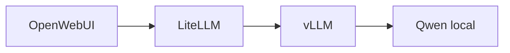

# Motor de inferencia

Un modelo es el conjunto de pesos y arquitectura. Un motor de inferencia es el sistema que ejecuta el modelo para responder peticiones de forma eficiente.

## Diferencia modelo vs motor

- Modelo: Qwen, Llama, Mistral. Define pesos y tokenización.
- Motor: vLLM, TGI, llama.cpp. Gestiona memoria, batching, streaming, KV cache y API.

## Arquitectura típica



## Conceptos clave

- API OpenAI-compatible: endpoints como `/v1/chat/completions`.
- Streaming: tokens parciales mientras se generan.
- Batching: agrupar peticiones para usar mejor GPU.
- Latencia: tiempo hasta respuesta.
- Throughput: tokens por segundo globales.
- GPU memory: memoria disponible para pesos, KV cache y buffers.
- KV cache: claves/valores de atención ya calculados para no recomputar contexto.
- PagedAttention: técnica de vLLM para gestionar KV cache de forma eficiente.
- Cuantización: reducir precisión de pesos para ahorrar memoria.
- Context length: tokens máximos en la ventana.

## Por qué OpenWebUI puede llamar a LiteLLM o vLLM

Si vLLM expone una API compatible con OpenAI, OpenWebUI puede tratarlo como si fuera un proveedor OpenAI. LiteLLM puede ponerse en medio para enrutar modelos, aplicar claves, logs, límites o proveedores múltiples.

## Ampliación curso: inferencia como problema de sistemas

Servir un LLM no es solo llamar a `model.generate`. En producción aparecen usuarios concurrentes, contextos largos, memoria GPU, streaming, colas, timeouts y compatibilidad de APIs.

### Fases de una petición

1. **Tokenización**: texto -> tokens.
2. **Prefill**: procesar todo el prompt/contexto inicial.
3. **Decode**: generar tokens uno a uno.
4. **Streaming**: devolver tokens parciales.
5. **Finalización**: stop tokens, usage, logs.

### Latencia vs throughput

- Latencia: cuánto espera un usuario.
- Throughput: cuántos tokens/s produce el sistema en total.

A veces mejoras throughput agrupando más peticiones, pero empeoras latencia individual. Por eso motores como [[vLLM]] intentan batching continuo.

### Memoria GPU

La memoria se reparte entre:

- pesos del modelo;
- KV cache;
- activaciones temporales;
- overhead del framework;
- fragmentación.

### Diagnóstico rápido

| Síntoma | Hipótesis |
|---|---|
| tarda mucho antes del primer token | prompt largo/prefill/modelo cargando |
| empieza rápido pero tokens lentos | decode lento/GPU saturada |
| errores OOM | modelo demasiado grande/contexto/concurrencia |
| streaming no aparece | proxy/gateway no transmite chunks |
| OpenWebUI dice modelo no encontrado | nombre de modelo/API base mal |

## Lección guiada

En inferencia, distingue modelo, servidor, gateway y cliente. Muchos errores parecen "del modelo" pero son de endpoint, streaming, memoria o configuración.

### Preguntas

- ¿Quién expone `/v1/chat/completions`?
- ¿Qué modelo real hay detrás del nombre?
- ¿Hay LiteLLM entre OpenWebUI y vLLM?
- ¿La lentitud está en prefill o decode?
- ¿Qué consume KV cache?

### Práctica

```bash
curl http://localhost:8000/v1/models
curl http://localhost:8000/v1/chat/completions
```

### Evidencia

- [ ] Puedo explicar KV cache.
- [ ] Puedo explicar batching y streaming.
- [ ] Sé qué preguntar sobre Qwen local.
