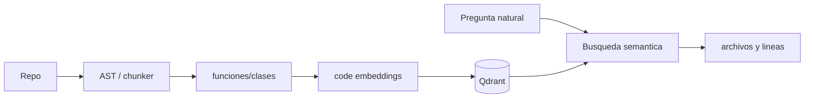

# Curso code embeddings y Qodo desde cero

## 1. Por que grep no basta

`rg` es excelente si sabes que palabra buscar:

```bash
rg -n "hybrid_search"
```

Pero a veces tu pregunta es conceptual:

```text
where is vector search implemented?
```

Puede que el codigo no contenga exactamente "vector search". Puede usar `query_collection`, `retriever`, `search_points` o una abstraccion.

Aqui entran code embeddings.

## 2. Text embeddings vs code embeddings

Text embeddings aprenden relaciones entre frases naturales. Code embeddings intentan representar codigo, nombres de funciones, docstrings, imports y estructura.

Consultas posibles:

- natural language -> code;
- code -> similar code;
- bug pattern -> sitios parecidos;
- funcion -> tests relacionados.

## 3. Chunking de codigo

No conviene indexar un repo como un bloque gigante. Opciones:

| Estrategia | Ventaja | Problema |
|---|---|---|
| por archivo | simple | archivos grandes mezclan temas |
| por funcion | mas preciso | requiere parser |
| por clase | util en OOP | clases grandes |
| por bloque AST | mejor estructura | mas complejo |

Metadata minima:

```json
{
  "file_path": "backend/open_webui/retrieval/utils.py",
  "symbol": "query_doc_with_hybrid_search",
  "start_line": 193,
  "end_line": 260,
  "language": "python",
  "commit": "abc123"
}
```

## 4. Qodo plataforma vs Qodo-Embed

Qodo puede referirse a una plataforma de desarrollo/testing asistido por IA. Qodo-Embed se refiere a modelos o capacidades de embeddings de codigo.

En una conversacion de empresa, pregunta:

- usan Qodo como herramienta SaaS?
- usan Qodo-Embed como modelo?
- indexan repos internos?
- donde guardan embeddings?
- usan Qdrant u otra vector DB?
- indexan por funcion/clase?

## 5. Como ayuda a leer repos grandes

Pipeline:



Esto no sustituye `rg`. Lo complementa.

Recomendacion:

1. usa `rg` para palabras exactas;
2. usa embeddings para preguntas conceptuales;
3. abre archivos y verifica manualmente;
4. escribe mapa de repo.

## 6. Ejercicio

```bash
python 13_Labs/code/code_embedding_indexer.py
```

Preguntas a probar:

```text
where is vector search implemented?
code that applies a patch
function that filters metadata
```

Luego compara:

```bash
rg -n "vector"
rg -n "patch"
rg -n "metadata"
```

## 7. Autocomprobacion

- [ ] Puedo explicar cuando usar `rg` y cuando embeddings.
- [ ] Puedo justificar chunking por funcion.
- [ ] Puedo proponer metadata para codigo.
- [ ] Puedo explicar por que la busqueda semantica debe verificarse leyendo codigo.
- [ ] Puedo preguntar en la empresa que significa exactamente "usan Qodo".

