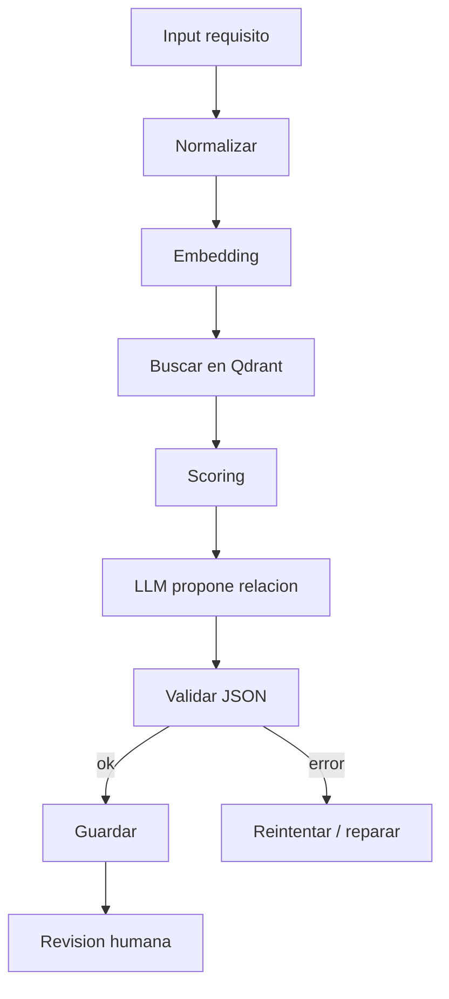

# Curso LangGraph y MCP desde cero

## 1. El problema

Un LLM por si solo responde texto. Un workflow de empresa necesita pasos controlados:

- recibir requisito;
- normalizarlo;
- buscar contexto;
- puntuar candidatos;
- llamar al LLM;
- validar JSON;
- guardar resultado;
- pedir revision humana.

LangGraph y MCP aparecen cuando quieres que el sistema no sea una unica llamada opaca al modelo.

## 2. Workflow como grafo

Un grafo tiene:

- nodos: pasos;
- edges: transiciones;
- estado: datos compartidos;
- condiciones: rutas segun resultados.



## 3. Estado

El estado evita pasar strings sueltos sin control.

Ejemplo conceptual:

```python
state = {
    "requirement": "...",
    "normalized": "...",
    "candidates": [],
    "llm_result": None,
    "errors": []
}
```

Cada nodo lee y escribe campos concretos.

## 4. Herramientas

Una herramienta es una funcion que el sistema puede invocar:

- buscar en Qdrant;
- leer archivo;
- ejecutar coverage checker;
- guardar resultado;
- consultar una API interna.

No debe ser magia. Debe tener:

- entrada tipada;
- salida clara;
- errores manejables;
- permisos controlados.

## 5. MCP

MCP intenta estandarizar como un cliente LLM habla con herramientas/recursos expuestos por servidores.

Modelo:

```text
LLM client -> MCP server -> tools/resources
```

Ejemplo de herramienta MCP:

```text
search_requirements(query, module) -> list[RequirementCandidate]
```

## 6. Riesgos

- herramientas demasiado poderosas;
- salida no validada;
- loops infinitos;
- prompts que mezclan decision y ejecucion;
- falta de trazabilidad;
- resultados sin revision humana.

## 7. Workflow recomendado para requirements testing

1. Input requisito.
2. Normalizar texto: limpiar, extraer IDs, modulo.
3. Buscar candidatos por BM25+dense.
4. Filtrar por metadata.
5. Pedir al LLM clasificacion JSON:

```json
{
  "relation": "duplicate|covers|contradiction|unrelated",
  "confidence": 0.0,
  "evidence": ["..."]
}
```

6. Validar JSON.
7. Guardar en CSV/base.
8. Marcar para revision humana.

## 8. Autocomprobacion

- [ ] Puedo dibujar un workflow como grafo.
- [ ] Puedo distinguir nodo, edge y estado.
- [ ] Puedo explicar MCP client/server.
- [ ] Puedo diseñar una herramienta con entrada/salida clara.
- [ ] Puedo explicar por que la validacion JSON es necesaria.

