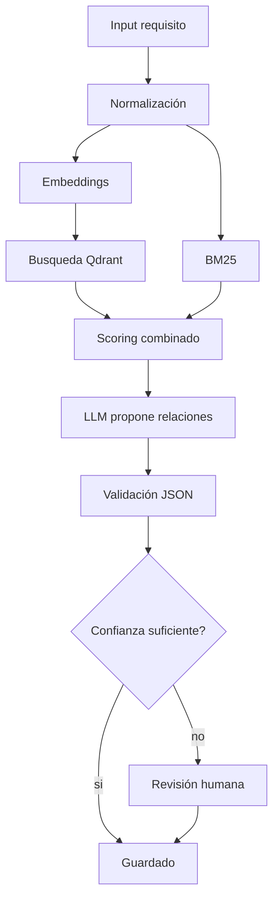

# Ejemplo workflow requirements testing



## Estado mínimo

```json
{
  "input_requirement": "...",
  "normalized": "...",
  "candidates": [],
  "scores": {},
  "llm_json": {},
  "validated": false
}
```

## Reglas

- El LLM no decide solo.
- Retrieval se evalúa contra golden set.
- JSON se valida antes de guardar.
- Relaciones dudosas van a revisión humana.

## Lección guiada

En workflows, piensa en pasos verificables. Un grafo bueno hace visible qué datos entran, qué herramienta se llama y qué validación ocurre.

### Preguntas

- ¿Cuál es el estado compartido?
- ¿Qué hace cada nodo?
- ¿Qué herramienta externa se llama?
- ¿Dónde se valida JSON?
- ¿Cuándo entra revisión humana?

### Evidencia

- [ ] Puedo dibujar el workflow.
- [ ] Puedo separar nodo, edge, estado y tool.
- [ ] Puedo detectar una herramienta demasiado amplia.
