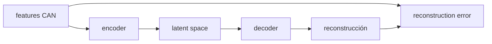

# Autoencoders

Un autoencoder aprende a reconstruir su entrada. Tiene encoder, latent space y decoder. Para anomalías, entrenas con datos normales; lo que reconstruye mal puede ser anómalo.



## Detección

1. Entrena solo con normal.
2. Calcula reconstruction error.
3. Fija threshold, por ejemplo percentil 99.
4. Marca error > threshold como anomalía.

## Riesgos

- Falso positivo: tráfico normal raro marcado como anomalía.
- Falso negativo: ataque/anomalía que el modelo reconstruye bien.
- Dataset normal contaminado.
- Features pobres.

## Ampliación curso: anomalía no significa ataque

Un autoencoder detecta desviación respecto a lo que aprendió como normal. Eso puede ser ataque, fallo, estado raro, captura corrupta o cambio legítimo de versión.

### Proceso correcto

1. Define qué es normal.
2. Separa entrenamiento normal de evaluación.
3. Normaliza features usando solo entrenamiento.
4. Entrena autoencoder.
5. Calcula error en normal y validación.
6. Elige threshold.
7. Evalúa en anomalías conocidas.
8. Revisa falsos positivos.

### Reconstruction error

Si `x` son features y `x_hat` reconstrucción:

```text
error = mean((x - x_hat)^2)
```

### Por qué entrenar solo con normal

Si entrenas con anomalías, el modelo aprende a reconstruirlas y dejan de destacar.

### Preguntas críticas

- [ ] ¿Mi dataset normal contiene anomalías?
- [ ] ¿El threshold se eligió con datos de test?
- [ ] ¿Las features tienen escala comparable?
- [ ] ¿Un cambio de software de ECU rompe el patrón normal?

## Lección guiada

En autoencoders, la pregunta no es "¿entrena?", sino "¿qué considera normal y qué errores produce?".

### Preguntas

- ¿Entrené solo con normal?
- ¿Qué features uso?
- ¿Cómo normalicé?
- ¿Cómo elegí threshold?
- ¿Qué falsos positivos aparecen?

### Práctica

```bash
python 13_Labs/code/can_autoencoder.py
```

### Evidencia

- [ ] Puedo explicar reconstruction error.
- [ ] Puedo justificar percentil 99.
- [ ] Puedo distinguir anomalía estadística de fallo real.
