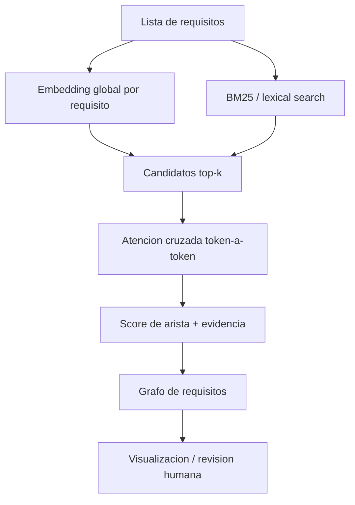

# Grafo de requisitos con atencion

## La idea correcta

No quieres hacer self-attention sobre una lista de 800 requisitos como si todos formasen una unica secuencia. Los requisitos son unidades independientes. Lo que quieres construir es un grafo:

```text
nodo = requisito
arista = relacion candidata entre dos requisitos
peso = fuerza/confianza de la relacion
evidencia = tokens o terminos que justifican la arista
```

La arquitectura razonable es:



> [!idea]
> La atencion no se usa para descubrir todos los pares desde cero. Se usa como segunda etapa para inspeccionar y refinar pares candidatos que ya parecen relacionados.

## Por que no todos contra todos

Con 800 requisitos hay:

```text
800 * 799 / 2 = 319600 pares
```

Si para cada par calculas atencion token-a-token, el coste sube rapido. Ademas, muchos pares seran obviamente irrelevantes: un requisito de luces no necesita compararse en detalle con uno de DoIP si no comparten nada.

Por eso se separa:

1. **recuperacion barata**: embeddings globales, BM25, Qdrant;
2. **analisis caro**: atencion cruzada solo para top-k candidatos;
3. **grafo**: guardar aristas con peso y evidencia.

## Representacion del grafo

Ejemplo de nodos:

```csv
id,module,text
REQ-UDS-001,diagnostics,The ECU shall support UDS service 0x22 ReadDataByIdentifier.
REQ-UDS-002,diagnostics,The ECU shall return NRC 0x31 when the DID is unsupported.
```

Ejemplo de aristas:

```csv
source,target,weight,candidate_score,attention_score,top_evidence,relation_hint
REQ-UDS-001,REQ-UDS-002,0.72,0.64,0.81,"UDS->DID; 0x22->NRC",diagnostics_related
```

El grafo no debe guardar solo `weight`. Debe guardar tambien evidencia. Si no, se vuelve una caja negra.

## Que significa "atencion" aqui

Para un par candidato `A, B`:

- tokens de `A` actuan como queries;
- tokens de `B` actuan como keys/values;
- obtienes una matriz `len(A) x len(B)`;
- extraes las conexiones token-token mas fuertes.

Ejemplo:

```text
A: ECU, support, UDS, service, 0x22, ReadDataByIdentifier
B: diagnostic, return, NRC, 0x31, DID, unsupported
```

Una arista interesante podria tener evidencia:

```text
0x22 -> DID
ReadDataByIdentifier -> DID
UDS -> diagnostic
```

> [!warning]
> Esto no prueba que los requisitos sean duplicados, contradictorios o cobertura. Solo da una señal interpretable para revisar.

## Score de arista

Una forma simple:

```text
edge_weight = 0.6 * candidate_score + 0.4 * attention_score
```

Donde:

- `candidate_score` viene de embeddings/BM25;
- `attention_score` resume la concentracion y fuerza de alineamientos token-token.

Ejemplo de attention score no supervisado:

```text
attention_score = media de los maximos por fila
```

Interpretacion:

- alto: muchos tokens de A encuentran algun token fuerte en B;
- bajo: la atencion esta dispersa o no hay alineamientos claros.

## Donde entra PCA

PCA no sustituye a la atencion. PCA sirve para reducir embeddings y visualizarlos en 2D:

```text
embedding de cada requisito -> PCA 2D -> scatter plot
```

Uso correcto:

- visualizar clusters de requisitos;
- ver si diagnostico, CAN, lighting se separan;
- pintar aristas encima de los puntos.

Uso incorrecto:

- decidir relaciones solo porque dos puntos quedan cerca;
- usar PCA como explicacion de dependencias.

Alternativas:

- PCA: lineal, rapido, interpretable;
- UMAP/t-SNE: visualmente buenos, menos estables para interpretar distancias;
- layout de grafo: usa aristas, no solo embeddings.

## Tres niveles de implementacion

### Nivel 1: no supervisado y didactico

Sirve para aprender:

1. embeddings/TF-IDF para candidatos;
2. atencion token-a-token con vectores simples;
3. grafo CSV/GraphML;
4. visualizacion.

No requiere labels.

### Nivel 2: no supervisado con modelos reales

Sustituyes:

- TF-IDF por sentence-transformers/Qdrant;
- vectores simples por embeddings contextuales de un Transformer;
- CSV por Qdrant/Neo4j/NetworkX.

Sigue siendo una señal, no verdad.

### Nivel 3: supervisado

Si tienes labels:

```text
(REQ_A, REQ_B) -> duplicate / covers / contradicts / related / unrelated
```

puedes entrenar:

- cross-encoder de pares;
- bi-encoder con contrastive learning;
- modelo con atencion aprendida;
- Graph Neural Network sobre el grafo.

Este nivel ya requiere dataset anotado y evaluacion.

## Pipeline recomendado para 800 requisitos

1. Limpia requisitos y metadata.
2. Calcula embedding global por requisito.
3. Recupera top-k candidatos por requisito con Qdrant/BM25.
4. Descarta candidatos con filtros obvios si procede.
5. Para cada candidato, calcula atencion cruzada.
6. Extrae top pares de tokens como evidencia.
7. Calcula `edge_weight`.
8. Guarda `edges.csv`.
9. Visualiza grafo.
10. Revisa manualmente una muestra.
11. Ajusta thresholds/top-k.

## Pseudocodigo

```python
requirements = load_requirements()
global_vectors = embed(requirements)

for req in requirements:
    candidates = retrieve_top_k(req, global_vectors, k=10)
    for cand in candidates:
        attn = cross_attention(req.text, cand.text)
        evidence = top_token_pairs(attn)
        edge_weight = combine(candidate_score, attn_score)
        if edge_weight >= threshold:
            save_edge(req.id, cand.id, edge_weight, evidence)
```

## Lab asociado

Ejecuta:

```bash
python 13_Labs/code/requirements_attention_graph.py
```

Salida esperada:

- `13_Labs/outputs/requirements_graph_edges.csv`
- `13_Labs/outputs/requirements_graph_nodes.csv`
- `13_Labs/outputs/requirements_graph.png` si hay librerias de grafo/plot.

## Preguntas de autocomprobacion

- [ ] Por que no uso self-attention sobre los 800 requisitos como una unica secuencia?
- [ ] Que etapa genera candidatos?
- [ ] Que etapa calcula evidencia token-token?
- [ ] Que significa una arista?
- [ ] Que guardo en `edges.csv` ademas del peso?
- [ ] Para que usaria PCA?
- [ ] Que necesito para pasar de señal no supervisada a clasificador fiable?

