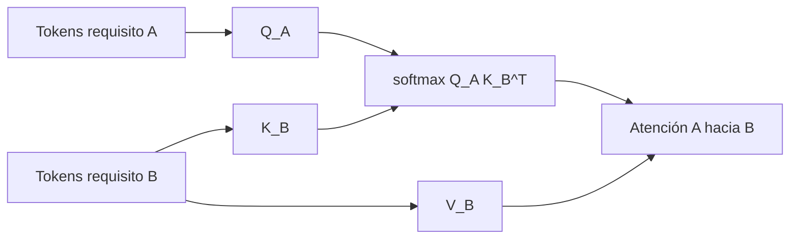

# Self-Attention vs Cross-Attention

## Self-attention

Queries, keys y values salen de la misma secuencia. Un requisito atiende a sus propios tokens.

## Cross-attention

Queries salen de una secuencia A y keys/values de otra secuencia B. Sirve para estudiar cómo tokens de un requisito A miran tokens de un requisito B.

## A -> B no es B -> A

La atención de A hacia B usa tokens de A como queries y tokens de B como keys. Al invertir, cambian queries y keys, por lo que la matriz y la interpretación cambian.



## Lección guiada

En atención entre requisitos, el objetivo es implementar y visualizar. No uses atención como veredicto; úsala como lupa.

### Preguntas

- ¿Quién aporta queries?
- ¿Quién aporta keys/values?
- ¿Qué forma tiene la matriz?
- ¿Por qué cada fila suma 1?
- ¿Por qué A -> B no equivale a B -> A?

### Práctica

```bash
python 13_Labs/code/attention_requirements_from_scratch.py
python 13_Labs/code/attention_requirements_with_transformers.py
```

### Evidencia

- [ ] Puedo derivar las dimensiones de Q, K, V.
- [ ] Puedo leer un heatmap.
- [ ] Puedo explicar por qué atención no es explicación causal.
